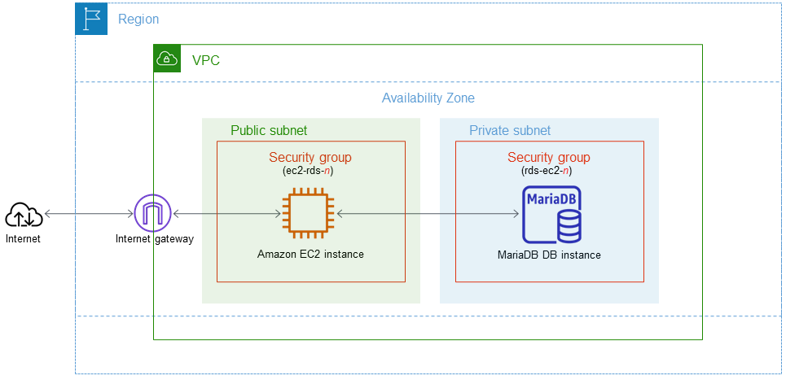
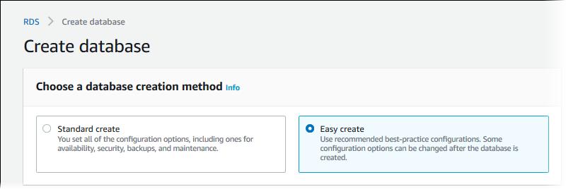

<h1>Creating and connecting to a MariaDB DB instance</h1>

<h2>Purpose of this project</h2>
To demostrate the deployment of a MariaDB database instance on Amazon Web Service (AWS) Relational Database Service(RDS) and connect it using a EC2 Instance.

<br/>

<br />

<h2>Description</h2>getting-started-mariadb.png
creates an EC2 instance and an RDS for MariaDB DB instance. The tutorial shows you how to access the DB instance from the EC2 instance using a standard MySQL client. As a best practice, this tutorial creates a private DB instance in a virtual private cloud (VPC). In most cases, other resources in the same VPC, such as EC2 instances, can access the DB instance, but resources outside of the VPC can't access it.
<br />


<h2>Technologies Used</h2>

- <b>Amazon RDS, MariaDB</b> 
- <b>EC2 Instance</b>

<h2>Steps to create and connect to the DB instance </h2>

- <b>Windows 10</b> (21H2)

<h2>This tutorial allows you to create your resources by using one of the following methods::</h2>

- <b>Use the AWS Management Console ‐ Create an EC2 instance and Create a MariaDB DB instance</b> 
- <b>Use AWS CloudFormation to create the database instance and EC2 instance ‐ (Optional) Create VPC, EC2 instance, and MariaDB instance using AWS CloudFormation</b>

<h2>Description</h2>
The first method uses Easy create to create a private MariaDB DB instance with the AWS Management Console. Here, you specify only the DB engine type, DB instance size, and DB instance identifier. Easy create uses the default settings for the other configuration options
<br />

<h2>Create an EC2 instance</h2>

- <b>Sign in to the AWS Management Console and open the Amazon EC2 console at https://console.aws.amazon.com/ec2/</b> 
- <b>In the upper-right corner of the AWS Management Console, choose the AWS Region in which you want to create the EC2 instance.</b>
- <b>Choose EC2 Dashboard, and then choose Launch instance.</b>
- <b>Choose the following settings on the Launch an instance page.

Under Name and tags, for Name, enter ec2-database-connect.

Under Application and OS Images (Amazon Machine Image), choose Amazon Linux, and then choose the Amazon Linux 2023 AMI. Keep the default selections for the other choices.</b>
- <b>Under Instance type, choose t2.micro.</b>
- <b>Under Key pair (login), choose a Key pair name to use an existing key pair. To create a new key pair for the Amazon EC2 instance, choose Create new key pair and then use the Create key pair window to create it.</b>
- <b>For Allow SSH traffic in Network settings, choose the source of SSH connections to the EC2 instance.

You can choose My IP if the displayed IP address is correct for SSH connections. Otherwise, you can determine the IP address to use to connect to EC2 instances in your VPC using Secure Shell (SSH). To determine your public IP address, in a different browser window or tab, you can use the service at https://checkip.amazonaws.com. An example of an IP address is 192.0.2.1/32.</b>
- <b>Leave the default values for the remaining sections.</b>
- <b>Review a summary of your EC2 instance configuration in the Summary panel, and when you're ready, choose Launch instance.</b>

<h2>Create a MariaDB DB instance</h2>
The basic building block of Amazon RDS is the DB instance. This environment is where you run your MariaDB databases.

- <b>Sign in to the AWS Management Console and open the Amazon RDS console at https://console.aws.amazon.com/rds/.</b>
- <b>In the upper-right corner of the Amazon RDS console, choose the AWS Region in which you want to create the DB instance.</b>
- <b>In the navigation pane, choose Databases.</b>
- <b>Choose Create database and select Easy create.</b>
<br/>

<br />
- <b>In Configuration, choose MariaDB.</b>
- <b>For DB instance size, choose Free tier.</b>
- <b>For DB instance identifier, enter database-test1</b>
- <b>For Master username, enter a name for the master user, or keep the default name.</b>
- <b>To use an automatically generated master password for the DB instance, select Auto generate a password.

To enter your master password, clear Auto generate a password, and then enter the same password in Master password and Confirm master password.</b>
- <b>To set up a connection with the EC2 instance you created previously, expand Set up EC2 connection - optional.

Select Connect to an EC2 compute resource. Choose the EC2 instance you created previously.</b>
- <b>Choose Create database.

To view the master username and password for the DB instance, choose View credential details.</b>
- <b>In the Databases list, choose the name of the new MariaDB DB instance to show its details.

The DB instance has a status of Creating until it is ready to use.</b>

<h2>Create VPC, EC2 instance, and MariaDB instance using AWS CloudFormation</h2>

<h4>This will be continued in the next repository</h4>

Instead of using the console to create your VPC, EC2 instance, and MariaDB instance, you can use AWS CloudFormation to provision AWS resources by treating infrastructure as code. To help you organize your AWS resources into smaller and more manageable units, you can use the AWS CloudFormation nested stack functionality. For more information, see Creating a stack on the AWS CloudFormation console and Working with nested stacks.

<!--
 ```diff
- text in red
+ text in green
! text in orange
# text in gray
@@ text in purple (and bold)@@
```
--!>
